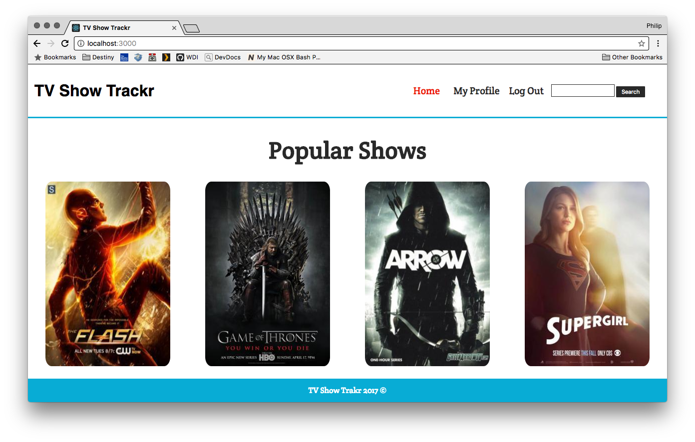

# TV Show Trackr



View TV Show Trackr hosted through Heroku here:

[TV Show Trakr](https://tvshowtrakr.herokuapp.com/)

## What is TV Show Trakr?

TV TrackR's page loads and immediately catches our users eye with clean, crisp design. The main page is full of the current most popular shows on tv. We made this our homepage so our user's can not only quickly intereact with what are most likely the shows they'd want to track but also so when they first think of TV Trackr they think of their favorite shows and vice versa. This page stands as our staging ground for moving everywhere else through our app. The user can choose to click on an individual tv show and see a ton of data including: A search bar lets our users find ANY show they want even if it is not listed on the top page. They may also choose to login or register with our site. Once logged in the navbar changes to reflect the users name and a logout button. Our user's are also given a host of new features once logged in, the biggest being able to actually track their favorite shows. While browsing the list of shows they can add them to their personal page and set up a schedule of what shows are on at what times and on what days. This is the heart of our app and really lets the user track what shows they want to watch and see if any of them come into conflicts. This is our MVP.

## Inspiration Behind TV Show Trackr 

While brainstorming during group bonding phase, our team discovered our commonalities through travel experiences, work, and tv shows. Our group lit up with energy when we began to discuss our favorite tv shows. It occurred to us that we could develop a web platform that would allow users to search for popular tv shows while creating an account that would allow them to save them to be viewed later. 

## Team Members

* Philip Zak
* Alex Calleia
* Seye Sijuwade
* Dennis Luo

## Technical Discussion

* Express
* React
* Axios
* React-Router-Dom

## Installation Instructions

Cloan repo and cd into it. Run yarn install in both the main project folder and then again in the client folder.

### Sample Code

```
componentDidMount(){
  let userid = localStorage.getItem("userid");
  let username = localStorage.getItem("username");
  if(userid){ this.setState({ auth: true }) };
  if(username){ this.setState({ auth: true }) };

  const popularShowsRequest = axios.get('https://www.episodate.com/api/most-popular?page=1')
    .then(res => this.setState({
      popularShows: res.data.tv_shows,
      apiDataLoaded: true,
      lastPage: res.data.pages
    }))
  const usersShowsRequest = axios.get(`/profile/${userid}`)
    .then(res => this.setState({
      usersShows: res.data
    }))

  Promise.all([popularShowsRequest])
    .then(() => {
        return usersShowsRequest
    })
    .catch(err => console.log(err));
}
```

## Proposal- User Story/Wireframes

[Proposal](https://github.com/zakphi/TVShowTrakr/blob/master/proposal.md)

## The Making of TV Show Trackr

Credits: 
* [Tv Maze](http://www.tvmaze.com/api)
* [Episodate](https://www.episodate.com/api)
* [Color Palette](http://pokepalettes.com/#magneton)

## Opportunities for Future Growth

Our team would definitely love to further develop our web platform by incorporating a feature that would allow users to post comments and rate TV shows. In addition we have discussed adding a scheduling feature that would notify users of their tv show times. 

I feel like we struggled working on the little things. We may have gotten lost in the weeds trying to get things like localy storing data so that we could refresh on the page. This unfortunately distracted us from larger ticket items like the aforementioned comments. Also I (Alex Calleia) will refactor all the CSS in Dreamweaver; down with Flexbox!
