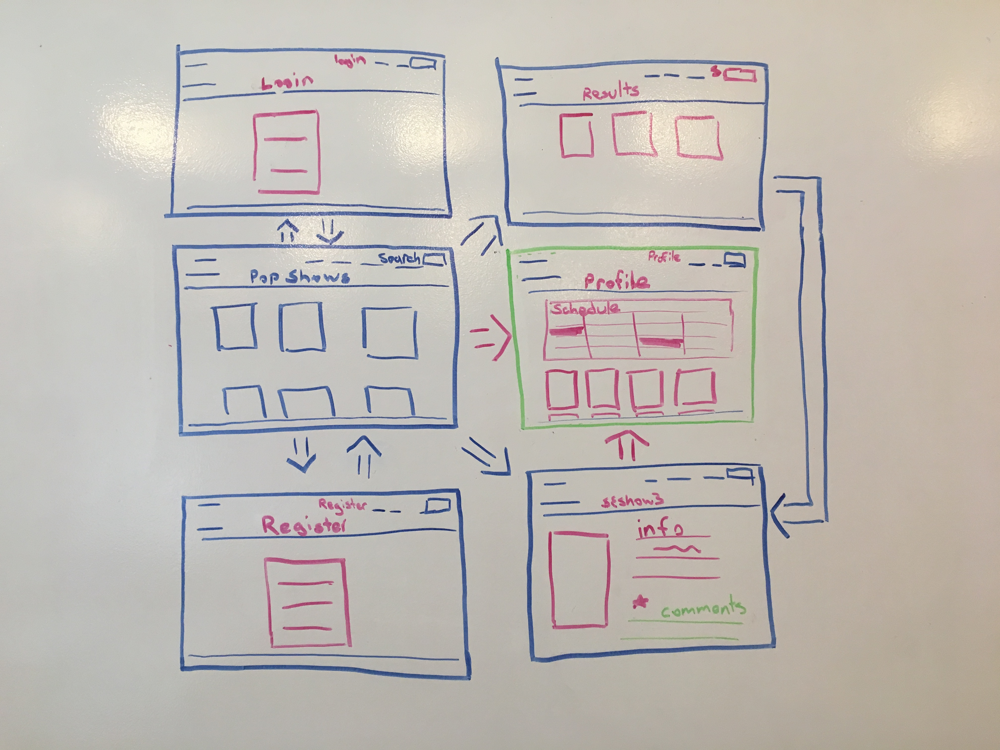
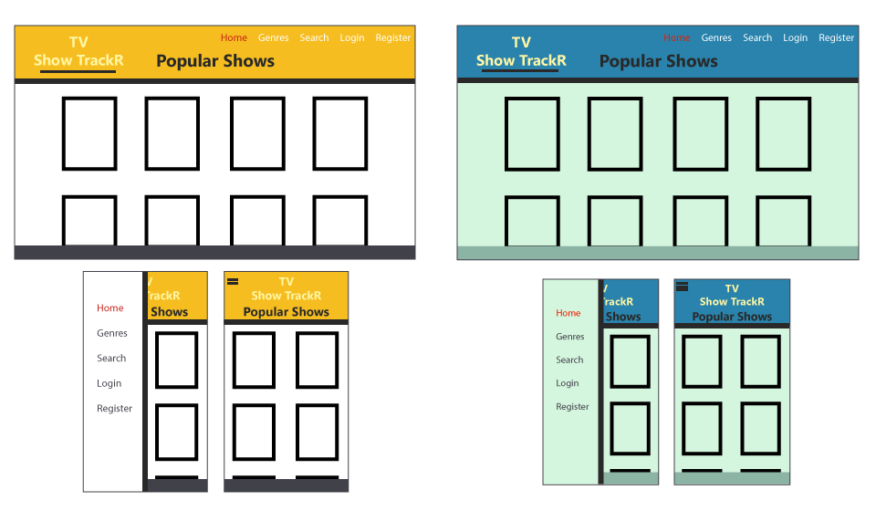

# TV Show Trakr Proposal

### The modern & sleek way of keeping track of all of your favorite shows

Team Members: Philip Zak, Alex Calleia, Dennis Luo, Seye Sijuwade

## What is TV Show Trakr?

TV TrackR's page loads and immediately catches our users eye with clean, crisp design. The main page is full of the current most popular shows on tv. We made this our homepage so our user's can not only quickly intereact with what are most likely the shows they'd want to track but also so when they first think of TV Trackr they think of their favorite shows and vice versa. This page stands as our staging ground for moving everywhere else through our app. The user can choose to click on an individual tv show and see a ton of data including: A search bar lets our users find ANY show they want even if it is not listed on the top page. They may also choose to login or register with our site. Once logged in the navbar changes to reflect the users name and a logout button. Our user's are also given a host of new features once logged in, the biggest being able to actually track their favorite shows. While browsing the list of shows they can add them to their personal page and set up a schedule of what shows are on at what times and on what days. This is the heart of our app and really lets the user track what shows they want to watch and see if any of them come into conflicts. This is our MVP.

## Wireframe

## User Stories

When page loads user sees popular shows. 

User can click on each show image to navigate to an indivudual tv show page where there is data rendered for the show.

From the home page the user can also use the nav bar to login or register. Both respectively lead to their own simple pages.

Once logged in the user now has access a profile page. Shows they favorite will be added to their profile.

A show that is favorited will be added to a schedule on the profile page that provides the user with a visual way to organize the shows they want to watch.

## Phases of Completion

### Phase 0 
- Initial setup
    - Create all necessary files and folders.

### Phase 1
- React Side 
    - Work with episodate api to populate popular show list on home page.
- Express Side
    - Set up database for users and tv shows.

### Phase 2
- React Side
    - Make second call to tvmaze api to get clicked show's information
    - Implement search feature
- Express Side
    - Set up auth on the backend

### Phase 3
- React Side
    - Set up auth on the frontend
    - User can favorite a show
- Express Side
    - Set up user profile
    - User's favorite shows are saved to db

## Reach MVP!!!
## Stretch Goals: 

### Phase 4
- Implement a schedule for user made up of their favorite shows

### Phase 5
- Create a genres category to the nav bar that would allow our users a more visual way of searching our entire database of shows.

### Phase 6
- Add a comments section on each shows single page so that registered users can discuss each show and really build a community. 

### Phase 7
- Implement a system that would send an email to our users 10-20 minutes prior to their saved show starting reminding them to get ready, put popcorn on, etc. 

## Links and Resources

- [Tv Maze](http://www.tvmaze.com/api)

- [Episodate](https://www.episodate.com/api)

